<style>
/* Global style */
section {
  /* background: #DFDFDA; */
}

h1 {
    /* background: #C2C2BD;
    padding: 2%; */
    color: #382D29;
    border-radius: 10px;
}

/* h1, h2, h3, h4 {
    color: black;
} */

/* PNG image transparent background workaround (issue#119) */
img {
    background-color: transparent!important;
}

/* Code block */
pre {
   background: #f6f7f6;
   /* font-size: 2em; */
}

/* Hyperlinks */
a {
    color: #2b7982;
}

/* Two columns */
/* https://github.com/orgs/marp-team/discussions/62#discussioncomment-257185 */
div.twocols {
  /* margin-top: 35px; */
  column-count: 2;
}
div.twocols p:first-child,
div.twocols h1:first-child,
div.twocols h2:first-child,
div.twocols ul:first-child,
div.twocols ul li:first-child,
div.twocols ul li p:first-child {
  margin-top: 0 !important;
}
div.twocols p.break {
  break-before: column;
  margin-top: 0;
}

</style>

# The case for Nix on the home server
## By Anthony Tarbinian & Samir Rashid
### Nixcon NA, March 15, 2024

<br /> <br /> <br /> <br /> <br />

Presentation permalink:
[godsped.com/nix-homeserver](https://godsped.com/nix-homeserver/)

---


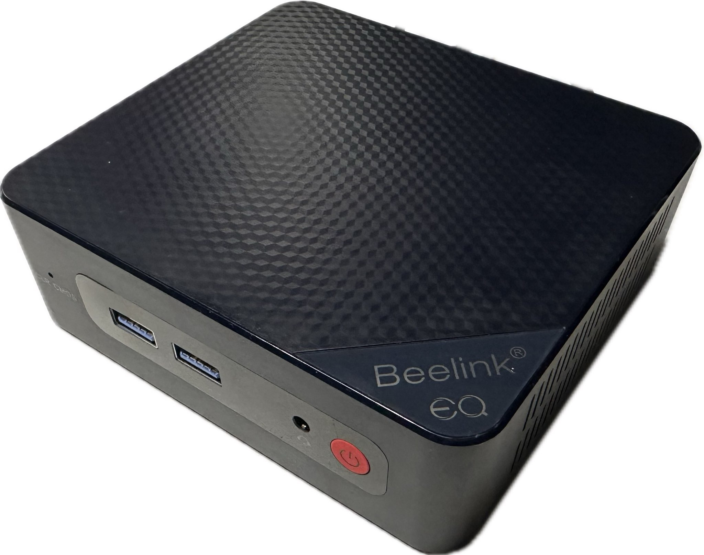

---

---
<!-- header: '' -->
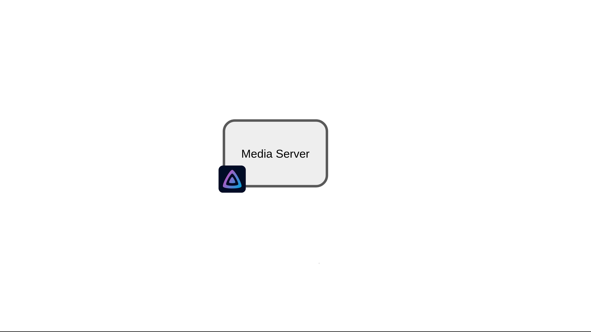

---
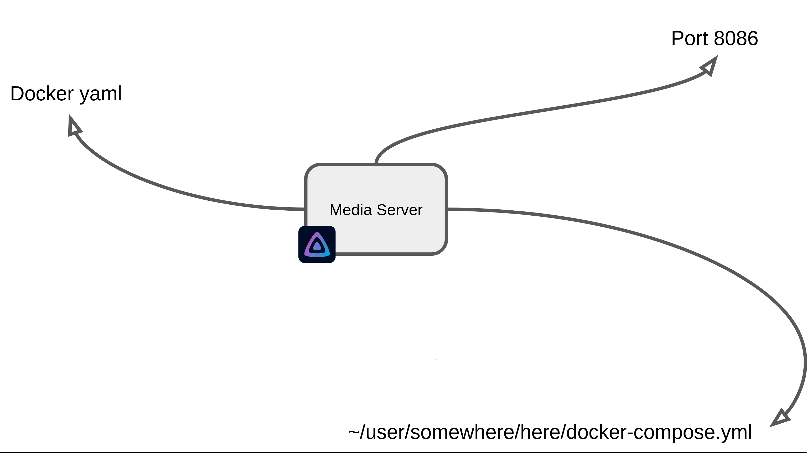

---
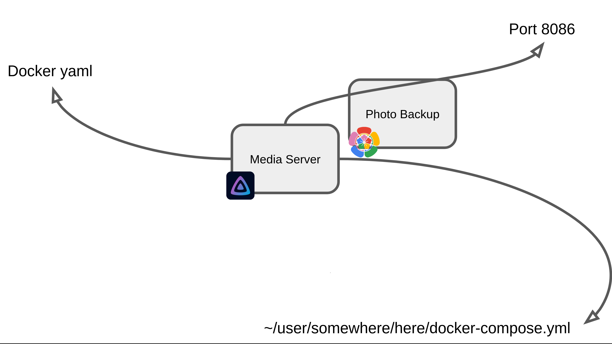

---
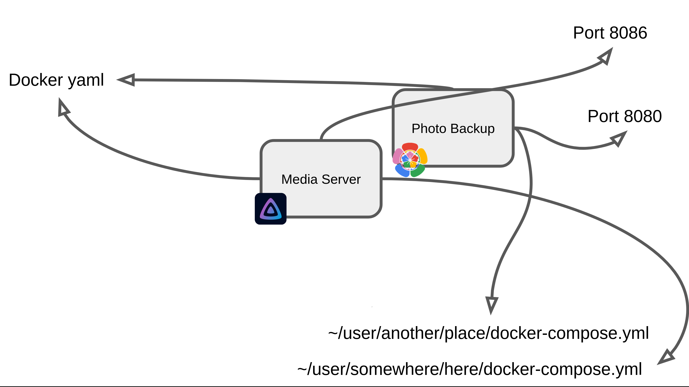

---
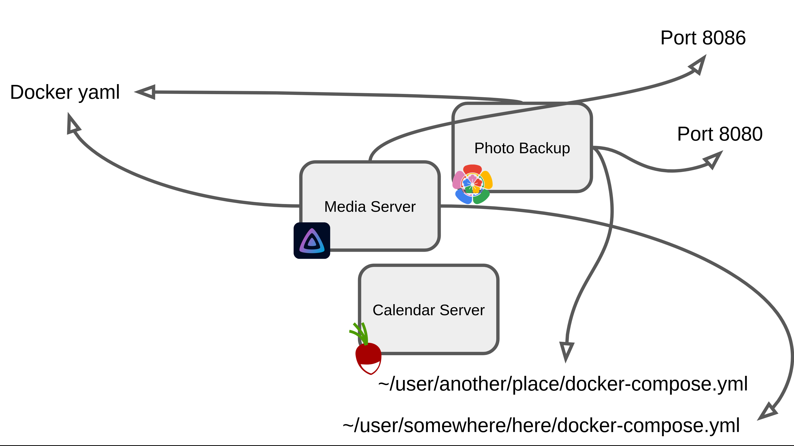

---
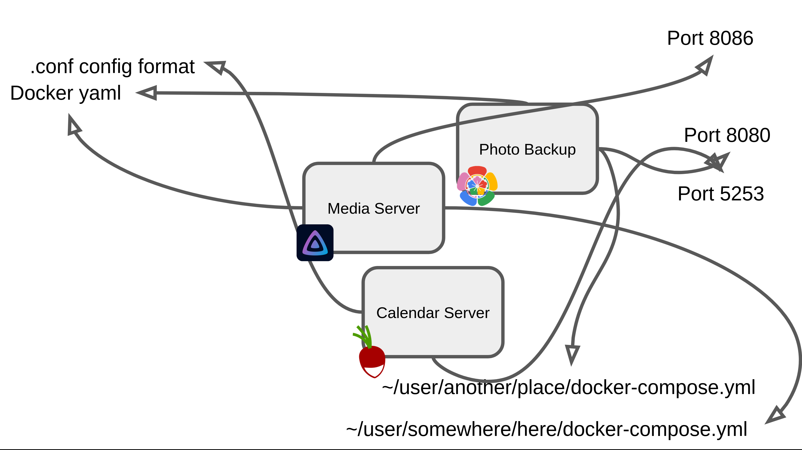

---
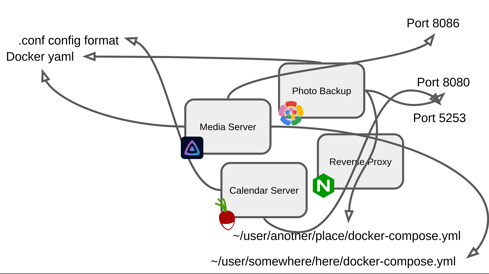

---
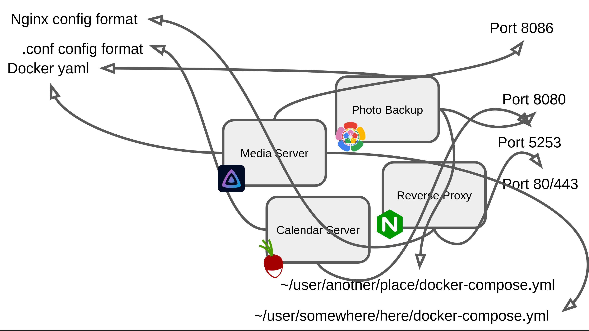

---
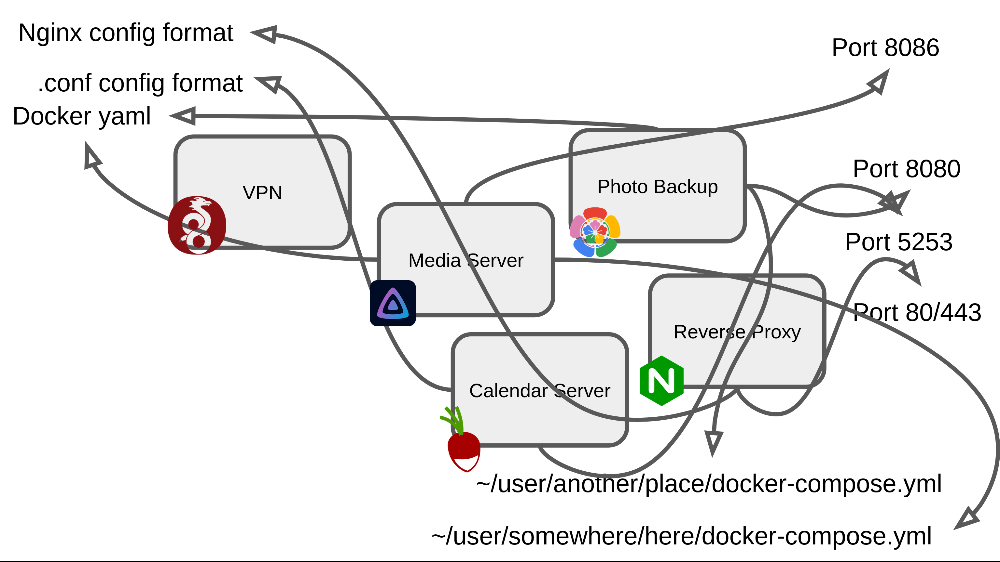

---
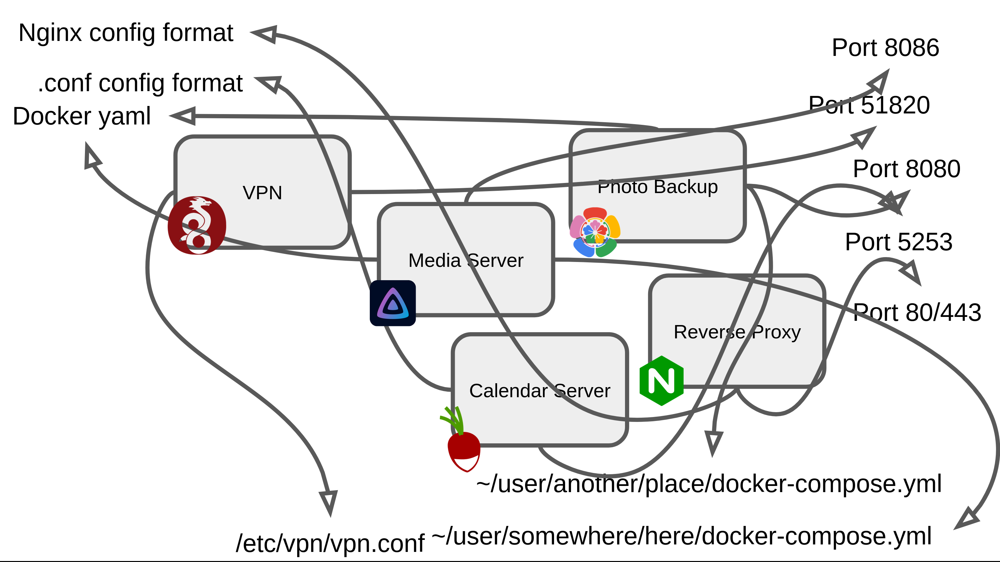

---
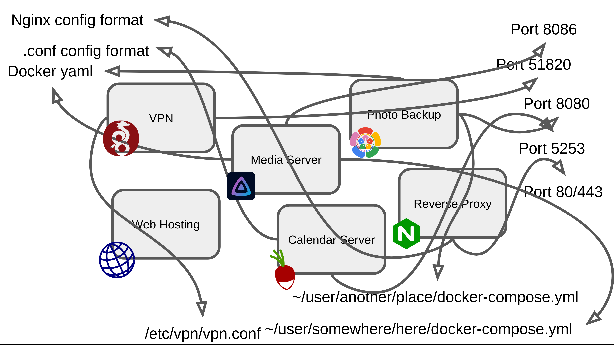

---
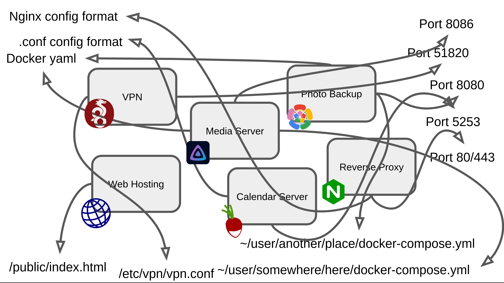

---
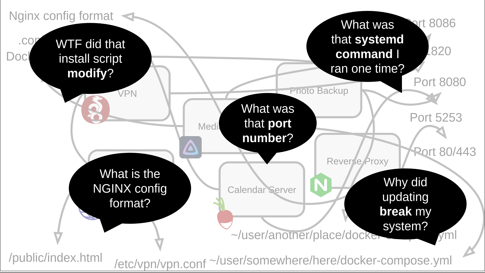

<!--
Hello everyone! Imagine you have just bought a new mini pc or raspberry pi and it's all pristine.

Then you start installing software to it...
-->
---

<!-- header: '' -->
<!-- _header: "" -->
<!-- _paginate: hide -->
<!-- _footer: <style>.attribution {color:#382D29; margin-left: 500px;}</style> <p class="attribution"><a href="https://archive.org/details/unix-magic-poster-gary-overcare-1">"UNIX Magic"</a> by Gary Overcare CC BY-NC-ND</p>-->

# The case for Nix <br>on the home server
## By Anthony Tarbinian<br>& Samir Rashid
### Nixcon NA, March 15, 2024

<br /> <br /> <br /> <br /> <br />

Presentation permalink:
[godsped.com/nix-homeserver](https://godsped.com/nix-homeserver/)


---

# Who are we

**Samir Rashid** is a student at UC San Diego. I'm working towards a future of understandable software.

**Anthony Tarbinian** is a student at UC San Diego. I'm a fan of open source software and public transit.

<!--
<switch speaker to Samir>
And my name is Samir Rashid. We are both students at UC San Diego.
-->
---

<style scoped>
p {
  font-size: 2.5em;
  text-align: center;
  font-weight: bolder;
  color: #5179BB;
  /* font-family: monospace; */
  /* background: skyblue; */
  border-radius: 10px;
  /* filter: drop-shadow(0.5rem 0.5rem 10px); */
}
</style>

# Benefits of a Nix home server

<br>

Fearless modifications

<p style="color:#3064BB">System-wide transparency</p>

<p style="color:#0A4EBF">Maintenance freeing</p>


<!-- 
Today we will be discussing how Nix allows you to fearless modify your home server, easily keep track of your system state, and make sure that managing your home server doesn't become your 9to5 job.
-->

---

<style scoped>
.container {
  display: flex;
  align-items: center;
  /* justify-content: center; */
}

/* Cross out the logos */
.crossed-out-image {
  position: relative;
  display: inline-block;
}

.crossed-out-image::before,
.crossed-out-image::after {
  content: '';
  position: absolute;
  width: calc(50% * 1.414); /* Diagonal length of the image */
  height: 4px;
  background-color: red;
  top: 50%;
  left: 50%;
  transform: translate(-50%, -50%) rotate(-45deg);
  z-index: 1;
}

.crossed-out-image::after {
  transform: translate(-50%, -50%) rotate(45deg);
}

.crossed-out-image img {
  display: block;
  max-width: 100%;
  height: auto;
  position: relative;
  z-index: -100;
}
</style>

<div class="twocols container">
<div class="">

# What is a home server?

- Host your own services
    - Photo Backup
    - Media Library
    - Website Hosting
    - Backups


</div>


<p class="break"></p>

<div style="width:40%; margin-left:100px" class="">

<!-- 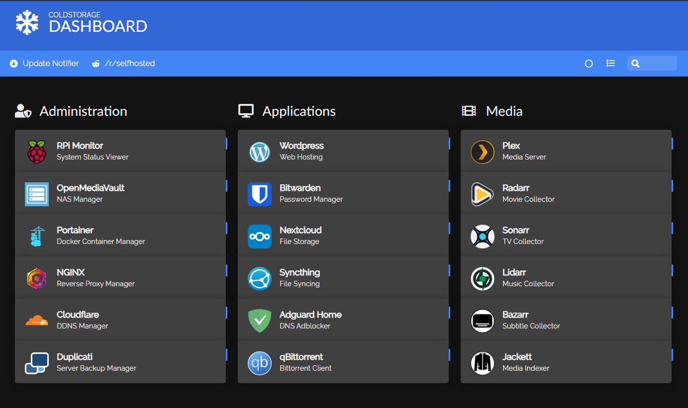 -->


<div class="crossed-out-image">
  
</div>

<div class="crossed-out-image">
  
</div>

</div>
</div>

<!-- 
A home server enables you to host your own services on hardware you own. 

You can host your own photo backups instead of relying on services like Google Photos and iCloud. In addition, you can host a media server, serve your own website and back up your files. You can find self-hosted services for anything you can imagine.
-->

---

<style>
img[alt~="center"] {
  display: block;
  margin: 0 auto;
  width: 70%;
}
</style>

# Expensive!?

<div class="twocols">

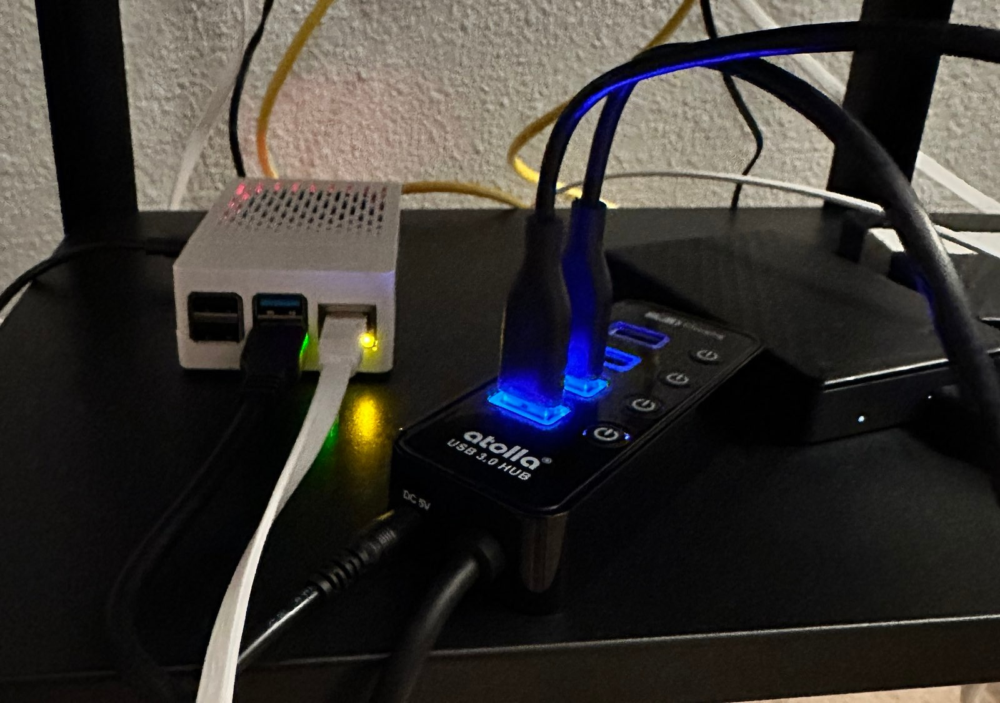

<br/>

<p class="break"></p>


</div>

---

<!-- _header: "" -->
# Why a home server?

- **Sovereignty**: own your own data 
    - Does not rely on cloud services
    - The Internet was meant to be distributed
- **Fun**: play with software


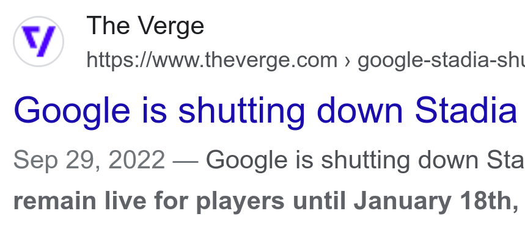

<!--
But why would you want to make a home server? With a home server, you can take back your freedom. <pause> You don't need to trust big tech with your data, worry about Google axing the service you use, or be at the mercy venture capitalists who put ads in your paid service.

Also, it's a lot of fun to play with software.
-->
---

# What is Nix?


<!-- 

So, what is Nix?

The term "Nix" encompasses the language, package manager, and the NixOS Linux distribution.

<pause>

This naming situation is complicated. The simple way to think about this is that Nix has an ecosystem built around the package manager. 

The Nix operating system, NixOS, is a Linux distrubtion which includes the Nix package manager and allows you to configure almost every aspect of your system.

However, you don't need NixOS to take advantage of Nix.

You can just install the Nix package manager to other OSes (such as Ubuntu or macOS)
-->

<a style="display:none">https://mermaid.live/edit#pako:eNpFj7EOwjAMRH_F8lwGypYRMVJAKmMWKzElKkmr1EFUVf-dtB16i613J9k3oekso8JBSPjiqInkD99SB8iyLrIR1wV4nnXY2BqEm_vBtIFFRwVXCk2ihndYKniQaTODikIecfdOCu49RxIXGqjHQdhv5owFeo6enM1frSc0yps9a1R5tRRbjTosOUrS1WMwqCQmLjD1di-B6kWfIVO2TrpYbTXXtvMfj2JNhQ</a>

---
<!-- _header: "" -->

# Why Nix?

- A way to configure your **entire system**
    - Write configuration in the Nix **language**
    - Build your system from your configuration 
- Create declarative, reproducible environments
    - Write once, build anywhere


<!--
So why would you want to use Nix?

The Nix language is the medium that allows you to configure your entire system.

<pause>

Once you write your configuration in Nix, you can build it. Building your system means that programs will be installed, config files will be generated, and services will be started automatically.

<pause>

Unlike other package managers, the end result will always be the same no matter who builds it or when they build it. This means that you can write your configuration once and build your system anywhere.

-->

---  

# What can you do in your Nix config?

### Installing packages
Just add this to `configuration.nix`
```nix
environment.systemPackages = with pkgs; [
    vim
    git
];
```

<!--
Let's see what Nix actually looks like in the wild.

<pause>

Nix configs are just text files.
Nix is a hybrid between a configuration format and a programming language. You have access to variables, functions, data structures and more.

<pause>

As you can see here, we can add these lines to our Nix config located in the configuration.nix file. This variable called systemPackages is a list that declares every package you want Nix to install for you. Based on the contents of this file, I can tell that vim and git will get installed to the system.

<pause>

Let's say I want to install a new program like tmux to my system.
-->
---

# What can you do in your Nix config?

### Installing packages
Just add this to `configuration.nix`
```diff
 environment.systemPackages = with pkgs; [
     vim
     git
+    tmux
];
```

<!--  
It's as easy as adding a single line to our configuration.nix

Now, when I rebuild my system, I can use tmux.
-->

---

# What can you do in your Nix config?

### Setup SSH Server
Just add this to `configuration.nix`
```nix
services.openssh = {
    enable = true;
    settings = {
	   PermitRootLogin = "no";
    };
};
```

<!-- 
You can also configure the settings of programs and services.

<pause>

Here we are setting an option for the SSH daemon. This is just another part of our configuration.nix file. By reading this file, I can quickly read the settings of all my programs. 

<pause>

Here I can see that I am enabling the SSH service. Instead of modifying my SSH config at `/etc/ssh/config`  I can set an option here to block all root login attempts. Nix will read this option and automatically generate a valid SSH config with the same setting.
-->

--- 

# Installing Home Server Applications

<!--  
Ok, so now let's talk about setting up a home server with Nix.
-->

---

# Jellyfin
- Popular open source media management software
- Host your own movies and music

<!--
Let's setup Jellyfin.

Jellyfin is a popular open source service to manage your personal media collection.

-->

---

# Install Jellyfin attempt

<style scoped>
img[alt~="center"] {
  display: block;
  margin: 0 auto;
  width: 90%;
}
</style>
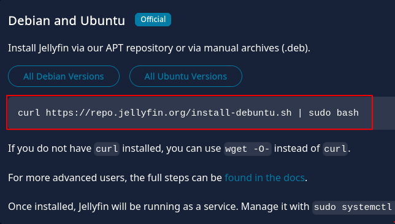

<!-- 
The Jellyfin docs suggest to pipe their install script into sudo bash. This script could be doing anything. We checked and their script is just adding their APT repository and installs their package.

The problem with running random bash scripts is that it is difficult to revert its effects. You would have to figure out what packages it installed, what sources it added, what files it modified.
-->
---

# In Nix

```Nix
services.jellyfin.enable = true;
```

<!--
On Nix it's just `services.jellyfin.enable = true;`

Uninstalling jellyfin as easy as removing this line from configuration.nix. 
-->
---

# What does this do?

```Nix
services.jellyfin.enable = true;
```

<br/>

- Download and install Jellyfin
- Create a systemd service to startup Jellyfin
- Start systemd service on boot

<!--
So what does this magical line actually do?

This one line which takes care of downloading, building, and installing jellyfin. This uses a recipe from `nixpkgs`, which is Nix's package store. When we rebuild, we'll have Jellyfin all set up and running in a matter of seconds.
-->
---

# Samba

- Networked file sharing

<!--
Let's add another service.

Samba is commonly used to share files over a network.
-->
---

# Setting up Firewall

### Without Nix
Need to manually run a `ufw` command
```bash
sudo ufw allow 139/tcp
```

### With Nix
```Nix
services.samba = {
    enable = true;
    openFirewall = true;
}
```

<!-- 
When setting up a service you want to access from other computers, you have to open a port in your firewall.

<pause>

On a traditional Linux system, you would need to look up the port number sambda uses and hunt down the right command to open up a firewall port.

If you use Nix, the complexity of opening the port is handled for you. You just have to set the openFirewall option and the same thing will be achieved.

<pause>

Say you want to uninstall samba. Normally, the network options are decoupled from the package, so the firewall port will stay open. Nix will automatically close this port if you set enable to false.
-->
---


<a style="display:none">https://www.iana.org/assignments/special-use-domain-names/special-use-domain-names.xhtml</a>
<!-- 
Now we have a few services running. Instead of accessing them from local IPs and memorizing their port numbers, let's give them pretty domain names. 
 -->

---

# Nginx

- Web server & reverse proxy

<!--
We can do this with nginx.

Nginx is a reverse proxy. For our home server, we use nginx to route all our services through the default HTTP port 80.
-->

---

# Where is Nginx's config file located?

<!-- 
The first thing you do when you install Nginx without Nix is you have to hunt down the location of the Nginx configuration file somewhere on your system. You'll inevitably forget the location and have to look it up again.  
-->

---

# Problem: too many config locations 

```s
/etc/
/opt/
/usr/local/etc/
~/.config/
~/.dotfile
~/.ssh/config
~/.local/share/
~/random-folder/docker-compose.yml
...
```

<!--  
As you install more and more software to your server, this issue can bubble out of control. As we demonstrated in the intro, you'll end up configs and dotfiles all across your system.
-->

---

# What format is `nginx.conf`?

- Why does Nginx use a bespoke configuration language?

<br>


<br>

[nginx.com](https://www.nginx.com/resources/wiki/start/topics/tutorials/config_pitfalls/)

<!-- 

Now that we have found the configuration file, we're greeted by a bespoke configuration language which Nginx invented and only they use.
 -->
---

# Problem: too many config formats

There's dozens of configuration formats:
- Nginx, SSH, JSON, YAML, TOML, CONF, INI, etc.

Nix simplifies this by having all your services share the same config language

<!-- 
This leads to one of the benefits of Nix. 

<pause>

As the server maintainer, you don't have to deal with the quirks of configuring each application. You can write all your configuration in a single language and move on with your day.
 -->
---

# Configure Nginx in Nix

```Nix
services.nginx = {
    enable = true;
    virtualHosts."jellyfin.local" = {
        locations."/" = {
            proxyPass = "http://127.0.0.1:8096/";
        };
    };
};
```

- We don't have to learn how to install Nginx, learn its bespoke configuration language.

<!--
These lines of Nix config will install nginx and route all traffic coming from jellyfin.local to Jellyfin's internal port.

I don't have to worry about where these config files go or learn the Nginx configuration language. And if I ever forget my nginx settings, I don't have to internet search where the config files are.

So you might be wondering where we are getting these nginx options from.
-->
---

# Nginx Options

<style scoped>
img[alt~="center"] {
  display: block;
  margin: 0 auto;
  max-width: 85%;
}
</style>

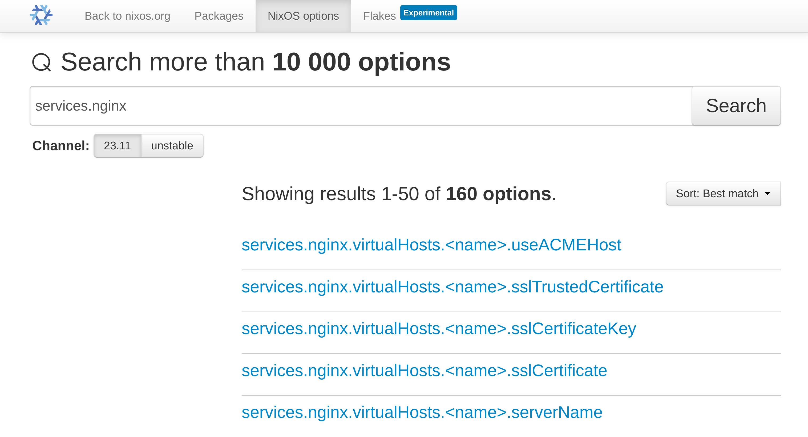

[search.nixos.org/options](https://search.nixos.org/options)
<!--
Every Nix option is listed on search.nixos.org/options.
-->
---

# Nix: Less Cognitive Overload
- All ports opened in **one** place
- All systemd services defined in **one** place 
- **One** config location
- **One** config format

<!--
<read slide>

In summary, using Nix prevents making home server management your full time job.

"Anthony, can you show me how else Nix can help managing my server?"
-->
---


<!-- _footer: XKCD -->

---

# Reusable 

Reuse building blocks from online
- Someone has made a NixOS config for whatever you want 
- Just as easy as copying a docker compose

<!--
Nix configs are modular. You can easily insert parts of someone else's config into yours. It's just as simple as copying a project's docker-compose.yaml.
-->
---

<!-- _header: "" -->

# Reusable: Mail Server

<div style="display:none">
```nix
mailserver = {
    enable = true;
    fqdn = "mail.example.com";
    domains = [ "example.com" ];
    loginAccounts = {
        "user1@example.com" = {
            hashedPasswordFile = "/a/file/containing/a/hashed/password";
            aliases = ["postmaster@example.com"];
        };
        "user2@example.com" = { ... };
    };
    certificateScheme = "acme-nginx";
  };
```
</div>

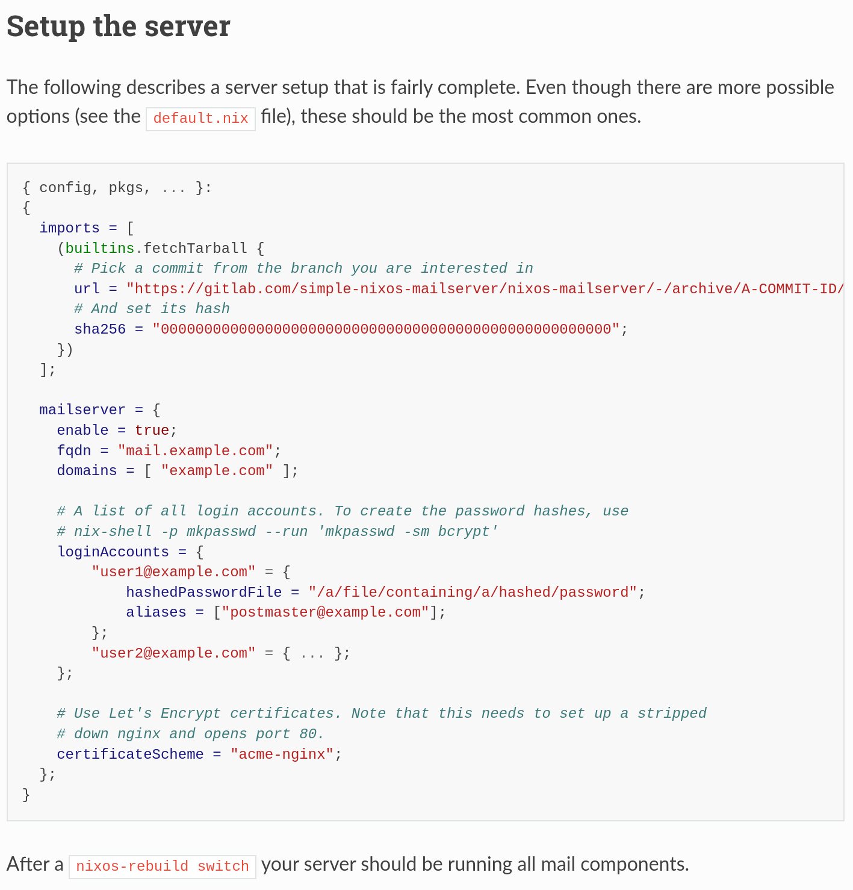

- Only a few lines!

[nixos-mailserver.readthedocs.io](https://nixos-mailserver.readthedocs.io/en/nixos-23.05/index.html)

<!--
Setting up new software can be annoying. You have to use an installer and change settings to make it work. If the instructions are out of date, you can spend hours debugging just to get the service to start.

The final boss of self hosting is setting up your mail server. Mail servers are complex, you need a daemon to send mail, another to serve your mail client, you need to set up a spam filter and virus scanning software.

We can use this nixos-mailserver project to do all the setup for us. The entire setup is just a sample Nix config. There are no manual steps and you will end up with exactly the same system setup as everyone else who runs this snippet.

We have put the entire server setup instructions on the slide. It's not 20 pages of commands you have to run. This is just a dozen lines of configuration code. And if you can read the bottom, the only command you need to run is "nixos-rebuild switch".

<pause>

This is so much easier than following a project's potentially out of date install instructions. There are no instructions to be out of date here, because there are no instructions. Once you experience the power of declarative configuration, you will never want to go back.
-->

---

# Reusable: Wireguard VPN

```nix
networking.wireguard.interfaces = {
wg0 = {
    ips = [ "10.100.0.1/24" ];
    listenPort = 51820;
    ...
    privateKeyFile = "path to private key file";
    peers = [
        { 
            publicKey = "{client public key}";
            allowedIPs = [ "10.100.0.2/32" ];
        }
        { 
            publicKey = "{john doe's public key}";
            allowedIPs = [ "10.100.0.3/32" ];
        }
    ];
};
};
```
[nixos.wiki/wiki/WireGuard](https://nixos.wiki/wiki/WireGuard)
<!-- 
Wireguard is a VPN. It allows you to access your server from anywhere, while not exposing it to the dangers of the public Internet.

Setting up wireguard is easy with Nix. Someone else has posted a sample config using the Nix options. You just need to copy it to your config and change a few fields.

Again, uninstalling wireguard with Nix will undo all the networking setup and leave your system how it was before.
-->

---

# Reusable across machines

- Configure software once across your machines
    - Even on different architectures

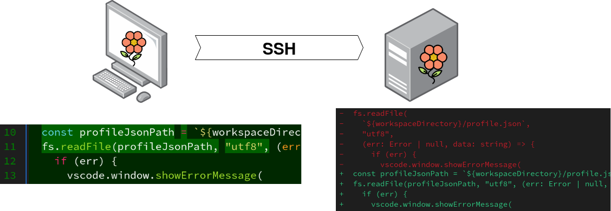

<!--
Since everything is managed by Nix, it is easy to reuse my configuration across machines.
When I SSH into my home server, I don't want to feel like sshing into the 70s. I want my customized setup and modern terminal utilities like this improved diff utility you can see down here.
-->
---

# Upgrading Server Software

<!--
Let's see how Nix makes updating your home server stress-free.
-->
---

# Upgrade Early, Upgrade Often

- Important to keep home server up-to-date
    - New application features
    - Security

<style scoped>
img[alt~="center"] {
  display: block;
  margin: 0 auto;
  width: 70%;
  margin-bottom: -15%;
}
</style>

[cvedetails.com](https://www.cvedetails.com/)

<!--
It's important to keep your home server up to date. You may want update to the next Jellyfin release. Also, there are new security vulnerabilites being found and patched all the time. You don't want to be victim of the next log4j. 
-->
---
<style scoped>
pre {
  font-size: 2em;
}
</style>

# Upgrading 

## APT (Debian/Ubuntu)

```sh
sudo apt-get upgrade -y
```

<!--
This is the command you use to update your system with APT.
-->
---
# What could go wrong while upgrading?

- Dependency conflict
- Unwanted changes
- Power gets cut mid-upgrade

<br />

... system gets left in broken state

<!-- 
You might think updating is a risk-free process. However, many things could cause an update to go awry. The latest version of Jellyfin might have a dependency conflict. Or the latest release might be buggy.

-->

---

# Does this really happen? Yes ...

<style scoped>
img[alt~="center"] {
  display: block;
  margin: 0 auto;
  width: 90%;
}
</style>

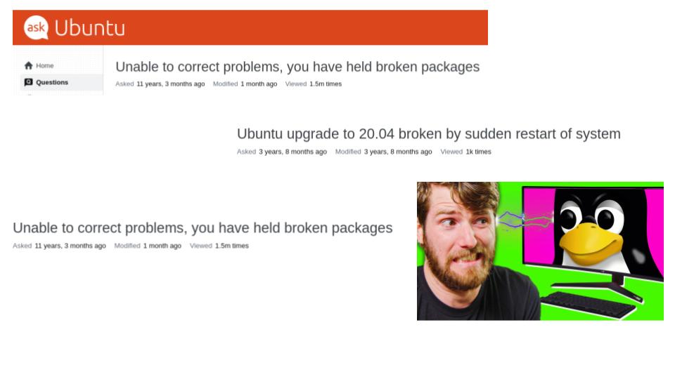


<!-- So yes, this really happens. Trust me, I know. -->

---
<style scoped>
code {
  font-size: 1.5em;
}
</style>

# Fearless upgrades

## APT (Debian/Ubuntu)

- `sudo apt-get upgrade -y`
- How to undo: impossible with APT *

## Nix (NixOS)
- `sudo nixos-rebuild switch`
- How to undo: `sudo nixos-rebuild --rollback`

<!--
With NixOS, you can easily rollback to a previous system state.

<pause>

With apt, it impossible to rollback from an upgrade.

You could try messing with `sudo apt update —fix-missing` and other similar commands but there's no guarantee that this will help. Whereas with Nix, you always know you can revert back to a known working state.

Because you are able to revert safely, your home server stays up if anything gets messed up.
-->

---
<!-- _header: "" -->

# Rollbacks

- NixOS maintains a version of your system each time you make a change
- Rollback to a previous version if something breaks
- Can fearlessly upgrade

<style scoped>
img[alt~="center"] {
  display: block;
  margin: 0 auto;
  width: 100%;
}
</style>
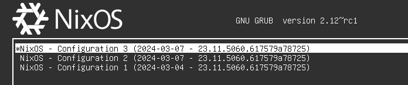

### Like git for your entire system
<!-- 
Nix rollback will revert all your binaries and configuration to the previous state automatically.

<pause>

As you can see on this screen, we can select the version of our system we want to boot into. Every time you build your system, Nix creates a new entry on this list. When things go wrong, you can easily go back to a previous version.

<pause>

It's like git for your whole system!

<pause>

Technically, you could still do the same thing with filesystem snapshots. However, unlike snapshots, Nix will not modify any user data. 
-->

---

# What's the secret sauce?

<style scoped>
img[alt~="center"] {
  display: block;
  margin: 0 auto;
  width: 80%;
}
</style>
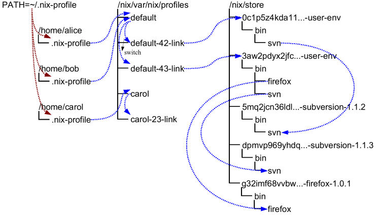


[nixos.org](https://nixos.org/manual/nix/stable/package-management/profiles)

<!--
So, how does this thing actually work?

It's just symlinks. When you upgrade, Nix won't overwrite existing packages. Nix keeps old versions of packages in this folder called the Nix store. Nix keeps track of which version is currently being used and symlinks that to the current profile.

When you want to upgrade or rollback, Nix just changes the symlink to point to the appropriate version.
-->

---


---

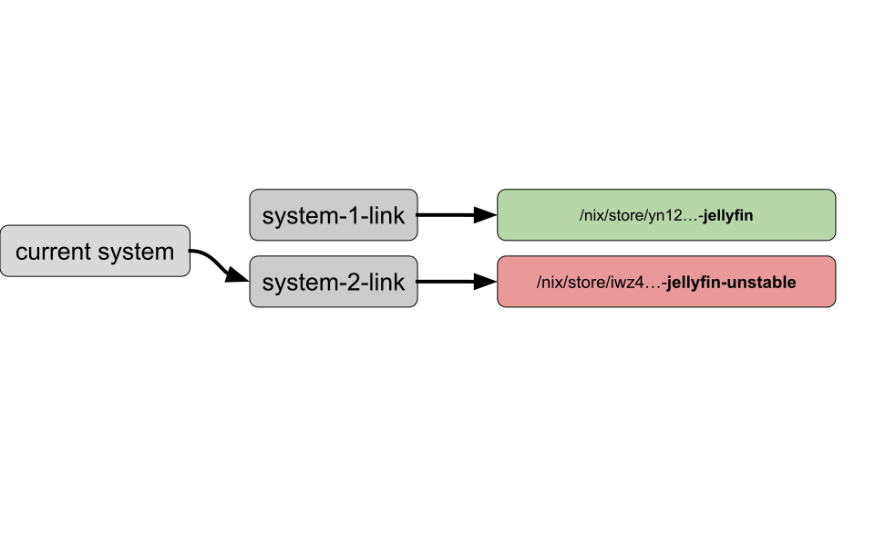

---


---

<div class="twocols">
<p style="padding-top:150px"></p>

# Version Pinning

- Install **both** bleeding edge, stable, and legacy software
- No conflicting dependency versions

<br/>

<p class="break"></p>

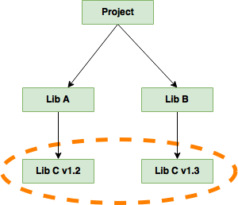

[vsvankhede.github.io](https://vsvankhede.github.io/2017/01/01/gradle-dependency-conflict/)

</div>

```nix
services.jellyfin.package = unstable.jellyfin;
```

<!--
Let's say you want the latest version of some package, but you don't want your system to break.

You don't need a bleeding edge distro like Arch where it's all or nothing
You don't have to bleed to have access to the bleeding edge

Let's say you want to pin a package to an old, stable version so it won't change during system upgrades. You can also do that!

Nix combines the best of Arch, where everything is on the bleeding edge, and Debian, where stability is the goal.

<pause>

This is impossible to do with other package managers. If one package is updated, then all dependencies must also be updated. You cannot have multiple versions of dependencies, which different packages require.

<pause>

As you can see in this diagram, we can have two programs depend on different versions of the same dependency. This is something normally impossible to do.

<pause>

In the Nix code snippet at the bottom, we can set what version our Jellyfin service should use. In this case, we only set Jellyfin to be on unstable while the rest of our system is left intact.
-->
---

# Docker vs Nix

<div class="twocols">

### Docker 

✅ Ubiquitous adoption

❌ Leaves `docker-compose.yml` files on your system 

❌ Versioning is opt-in

❌ Not integrated with host system
<!-- - Containers not built using trusted infrastructure -->
<p class="break"></p>
<p></p>

### Nix

❌ Requires effort to package

✅ Nice to have all your services defined in one place

<!-- ✅ Configure using a programming language (variables, loops) -->

✅ Easy to rollback

✅ Manages system state

</div>

---

# Docker vs Nix: Why choose one?

- Can startup Docker containers on boot from within Nix 
- Can [pin](https://ryantm.github.io/nixpkgs/builders/images/dockertools/#ssec-pkgs-dockerTools-fetchFromRegistry) images to Docker image hash
- Can use existing `docker-compose.yml` with `compose2nix` tool
  - [github.com/aksiksi/compose2nix](https://github.com/aksiksi/compose2nix)

<style scoped>
img[alt~="center"] {
  display: block;
  margin: 0 auto;
  width: auto;
  max-height:80%;
}
</style>
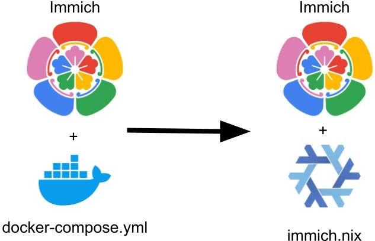

<!--
However, you don't have to choose. You can manage containers in your Nix config.

<switch speaker to Samir>
-->
---

# Ansible vs Nix 

<div class="twocols">

### Ansible

❌ No undo if OS update breaks

<!-- ❌- Ansible doesn't have backwards compatibility (maybe in recent versions but we should check) -->
❌ Ansible is notoriously slow

❌ Interrupting Ansible can break system

❌ Easy to drift away defined Ansible state

<p class="break"></p>
<p></p>

### Nix

✅ Rollbacks

✅ Nix is highly cached <!-- running nixos rebuild a second time should take almost no time -->

✅ Nix builds are atomic <!-- cannot leave your system in an undefined state if a nix rebuild fails -->

✅ Nix encourages reproducibility <!-- Nix has high friction when trying to modify system state outside the config -->
</div>


<!--
Let's also check out how Nix differs from Ansible.

<read slide>

Ansible valiantly tries to bolt on declarative environments onto a world which is not deterministic. Nix is trying to make the world determiistic.
-->
---

# Drawbacks

* Inconsistent configuration options
* Sparse documentation
* Confusing error messages
* Fragmented standards
* Different line of thinking
    - "Normal" things may not work the way you expect and are used to
 
<!--
There are a few rough edges with Nix.

<pause>

Some services may not have the options you expect. There is no standardization for what options every service must have. For example, the openFirewall option isn't on every service.

The documentation is not as good as the arch wiki. There are many edge cases which can be hard to fix.

Nix's confusing error messages definitely do not help with this.

The community is currently split on whether to adopt a new feature called flakes. As someone new to Nix, it can be confusing to see documentation using different standards.

Nix works fundamentally different than other package managers. But if you learn the Nix way of doing things, you will eliminate many types of problems.
-->
---

# Is Nix better?

---

# Nix is (Maintenance) Freeing

* ### **You don't want managing your home server to be your full time job**
* `configuration.nix` is self documenting and gives you an easy way to see an overview of the system
* You don't have to worry about breaking things when you make changes. 

<!-- 
read it
-->
---

# Benefits of a Nix home server

- Fearless modifications: **rollbacks make upgrades risk free**

- System-wide transparency: **configuration.nix is just a text file with everything specified about your system**

- Maintenance freeing: **reusable components, don't have to memorize commands or config formats**

<!--
Read it.
-->
---

<!-- _header: "" -->
# Try it at home!

See the following GitHub repo for a simple example NixOS configuration:

[`github.com/atar13/nixcon24-home-server`](https://github.com/atar13/nixcon24-home-server)


<br />

Contact us: nixcon@godsped.com

<!--
It's easy to get up and running with your own Nix home server using the github repo at this link by scanning the QR code. We made a minimal configuration with Jellyfin and samba.

Using Nix a vote for the future of deterministic software. And with that, thank you for attending our talk.
-->
